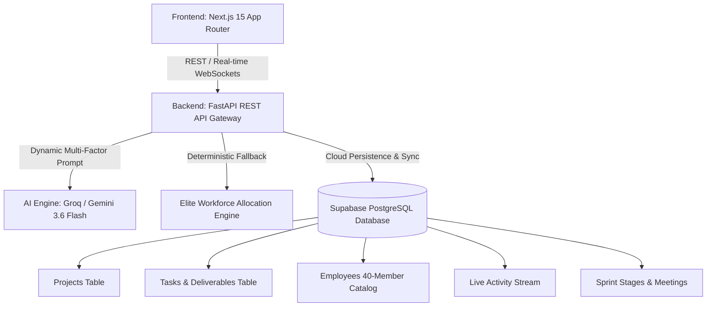

# 🚀 Kuiper — Enterprise AI Decision Intelligence & Dynamic Workforce Allocation Platform

[](https://nextjs.org/)
[](https://fastapi.tiangolo.com/)
[](https://supabase.com/)
[](https://groq.com/)
[](https://www.typescriptlang.org/)

**Kuiper** is an enterprise-grade AI decision intelligence and automated project planning system. It empowers Engineering Managers, Technical Project Leads, and Developers to evaluate project feasibility, predict risk matrices, balance sprint workloads, and dynamically allocate deliverables across a 40-member engineering workforce with zero hardcoding and deterministic capacity governance.

---

## 🏗️ System Architecture



---

## 🌟 Key Features

### 1. 🤖 Dynamic AI Multi-Factor Workforce Allocation
- **Dynamic Context Reasoning**: Full project requirements, phased deliverables, and the entire 40-member employee database (skills, experience, current workload, previous projects, availability) are streamed to LLM models (**Groq `openai/gpt-oss-120b`, `qwen/qwen3.6-27b`** and **Google Gemini `gemini-3.6-flash`**).
- **Strict Capacity Governance ($\le 70\%$)**: Workers with $>70\%$ workload are excluded. Projected workload is dynamically tracked so no worker ever exceeds $70\%$.
- **Domain & Role Alignment**: Prevents misallocations (e.g., Technical Writers are never assigned core backend/security/cloud architecture deliverables).
- **Automatic Fallback**: Deterministic global optimization engine ensures 100% uptime even if external APIs experience rate limits.

### 2. ⚡ Real-Time Supabase Synchronization
- Instant persistence of project blueprints, sprint deliverables, task status transitions, and calendar meetings.
- Live progress aggregation (Completed vs. In Progress vs. To Do) updated as developers transition tasks.

### 3. 🎯 Multi-Role Collaborative Workspaces
- **Engineering Portfolio Manager** (`manager@company.ai`): Executive KPIs, project creation, feasibility radars, what-if resource simulation sandboxes, and PDF blueprint exports.
- **Sprint / Project Lead** (`lead@company.ai`): Gantt charts, deliverable milestones, one-click AI workforce allocation modal, and stage progression controls.
- **Staff Engineer / Developer** (`employee@company.ai`): Kanban task board, deliverable claiming, time tracking, and sprint task status management.

### 4. 📊 Predictive Feasibility & Simulation Sandbox
- 5-Dimension Feasibility Radar (Scope, Timeline, Manpower, Technical Risk, Complexity).
- Interactive What-If sliders recalculating project viability, timeline buffers, and resource deficits in real time.

---

## 📁 Repository Structure

```
AI-Powered-decision-Intelligence-/
├── EMPLOYEE_ID.xlsx                  # Master 40-member employee dataset
├── README.md                         # Comprehensive documentation
├── .gitignore                        # Standardized ignore rules
│
├── backend/                          # FastAPI Python Backend
│   ├── main.py                       # API Gateway & Route Controllers
│   ├── requirements.txt              # Production Python dependencies
│   ├── .env.example                  # Environment configuration template
│   │
│   ├── db/                           # Database & Storage Layer
│   │   ├── employees_data.py         # Full 40-employee catalog & auth
│   │   ├── storage.py                # Database factory selector
│   │   ├── supabase_schema.sql       # Complete DDL & 40-employee seed SQL
│   │   └── supabase_storage.py       # Supabase Cloud ORM & cache engine
│   │
│   ├── models/                       # Pydantic Schemas & Data Contracts
│   │   └── schemas.py                # Type-safe request/response definitions
│   │
│   ├── services/                     # Business Logic & AI Engines
│   │   ├── ai_analyzer.py            # AI Project Feasibility & Groq/Gemini Allocator
│   │   └── elite_allocator.py        # Deterministic 6-Phase Optimization Engine
│   │
│   ├── scripts/                      # Utility & Data Migration Scripts
│   │   └── parse_employees.py        # Excel to dataset extraction tool
│   │
│   └── tests/                        # Automated Integration Tests
│       └── test_sync_flow.py         # End-to-end Supabase sync test suite
│
└── frontend/                         # Next.js 15 Frontend
    ├── package.json                  # Node.js dependencies
    ├── tsconfig.json                 # TypeScript strict configuration
    ├── next.config.ts                # Next.js build & routing config
    ├── .env.example                  # Frontend environment template
    │
    └── src/
        ├── app/                      # App Router Pages
        │   ├── layout.tsx            # Global layout & notification provider
        │   ├── page.tsx              # Manager Executive Dashboard
        │   ├── login/                # Multi-role authentication portal
        │   ├── lead/                 # Project Lead workspace
        │   ├── employee/             # Developer Kanban board
        │   ├── calendar/             # Sprint meetings & timeline calendar
        │   └── projects/[id]/        # Deep-dive Project Feasibility & Gantt
        │
        ├── components/               # Modular UI Components (Charts, Modals, Sidebar)
        ├── context/                  # Authentication & Notification Context
        ├── lib/                      # API Client & Supabase SDK helpers
        └── types/                    # Shared TypeScript interfaces
```

---

## 🚦 Quick Start Guide

### Prerequisites
- **Python 3.10+**
- **Node.js 18+** & **npm**

---

### 1. Backend Setup

```bash
cd backend
pip install -r requirements.txt
```

Create `backend/.env` (or copy from `backend/.env.example`):
```env
GEMINI_API_KEY=your_gemini_api_key
GOOGLE_API_KEY=your_gemini_api_key
GROQ_API_KEY=your_groq_api_key

SUPABASE_URL=https://ezigpxtfnkzdhekrlmkd.supabase.co
SUPABASE_SERVICE_ROLE_KEY=your_supabase_service_role_key
SUPABASE_ANON_KEY=your_supabase_anon_key
```

Start the backend server:
```bash
python main.py
```
*API Gateway runs at `http://127.0.0.1:8000` (Swagger docs at `/docs`).*

---

### 2. Frontend Setup

```bash
cd frontend
npm install
npm run dev
```
*Web application runs at `http://localhost:3000`.*

---

## 👥 Demo User Accounts

| Role | Email | Name | Default Workspace |
| :--- | :--- | :--- | :--- |
| **Engineering Manager** | `manager@company.ai` | Arjun Reddy | Portfolio KPIs & AI Project Creator |
| **Project / Sprint Lead** | `lead@company.ai` | Ishita Rao | Sprint Gantt & AI Task Allocation |
| **Staff Engineer** | `employee@company.ai` | Rahul Kumar | Kanban Board & Sprint Deliverables |

*(Password for all demo accounts: any password or `password123`)*

---

## 🛡️ Key API Endpoints

- `POST /api/projects`: Analyze project feasibility with AI & create project record.
- `GET /api/projects`: List all portfolio projects with KPIs and analysis.
- `POST /api/projects/{id}/ai-allocate-tasks`: Trigger dynamic AI workforce allocation across the 40-member team.
- `POST /api/projects/{id}/confirm-task-allocation`: Persist confirmed sprint deliverables into Supabase.
- `PATCH /api/tasks/{id}`: Update deliverable status (`To Do` $\rightarrow$ `In Progress` $\rightarrow$ `Completed`).
- `GET /api/projects/{id}/sprint-summary`: Real-time aggregated sprint progress metrics.

---

## 📄 License
MIT License. Built for Enterprise AI Project Intelligence.
